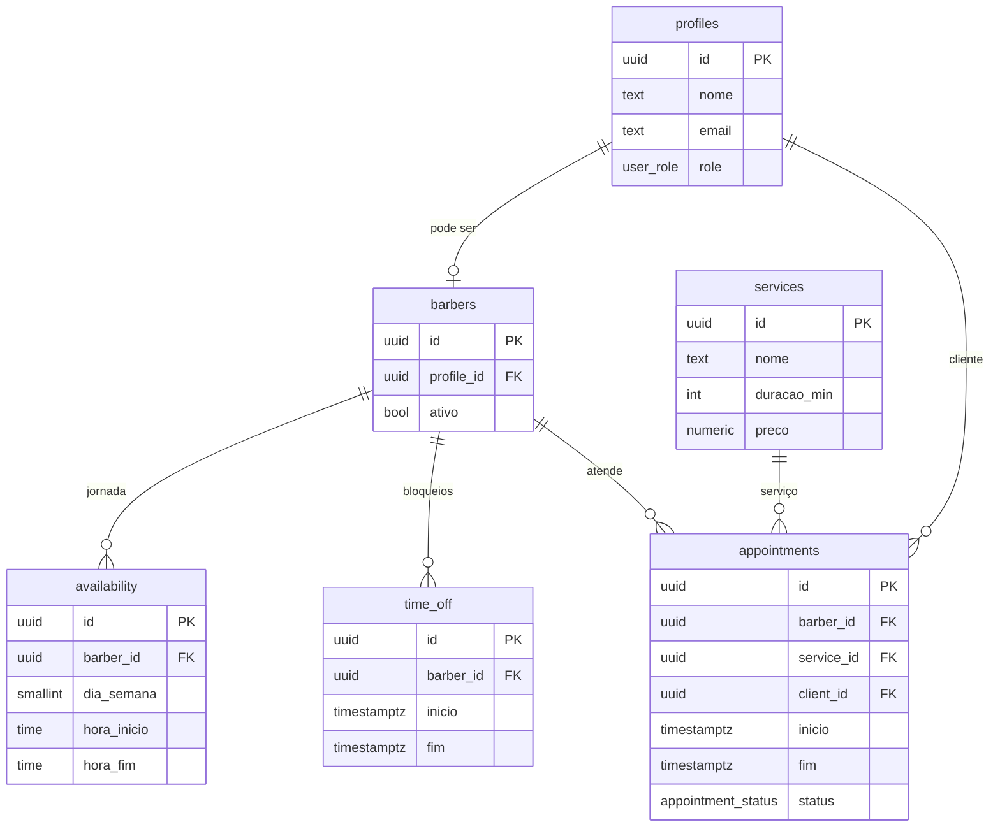

<div align="center">

# ✂️ Barbearia

### Sistema de agendamento online para barbearias

*Cliente agenda em segundos · Barbeiro organiza a agenda · Admin no controle*

<br/>

[](https://github.com/LuizBianghiDeveloper/Sistema-de-Barbearia/actions/workflows/ci.yml)


</div>

---

## 📖 Sobre

Aplicação web completa para agendamento em barbearias com **múltiplos barbeiros** e três perfis de acesso (**cliente**, **barbeiro** e **admin**). O coração do sistema é um **motor de disponibilidade** que calcula os horários livres respeitando jornada de trabalho, bloqueios, agendamentos existentes e fuso horário — com prevenção de _double-booking_ garantida no próprio banco de dados.

> 💡 Tema visual "barbearia clássica": escuro, com detalhes em dourado. Mobile-first — o cliente agenda pelo celular.

---

## ✨ Funcionalidades

### 🙋 Cliente
- Cadastro, login e recuperação de senha
- Agendamento guiado: **serviço → barbeiro → data → horário → confirmar**
- Lista de agendamentos (próximos e histórico) com cancelamento (até 12h antes)

### 💈 Barbeiro
- Agenda por **dia** e **semana**, com navegação por data
- Configuração da **jornada semanal** (múltiplos intervalos por dia)
- **Bloqueios e folgas** pontuais (com aviso se cobrir agendamentos ativos)
- Criação/cancelamento na própria agenda, inclusive **cliente avulso** (sem conta)

### 🛠️ Admin
- Gestão de **barbeiros** (ativar/desativar)
- Catálogo de **serviços** (nome, duração, preço)
- Visão da agenda de **qualquer** barbeiro

<details>
<summary><b>Matriz de permissões completa</b></summary>

| Ação | Cliente | Barbeiro | Admin |
|---|:---:|:---:|:---:|
| Cadastrar-se / autenticar | ✅ | ✅ | ✅ |
| Ver serviços e horários livres | ✅ | ✅ | ✅ |
| Criar / cancelar o **próprio** agendamento | ✅ | ✅ | ✅ |
| Ver **todos** os agendamentos | ❌ | Só os seus | ✅ |
| Criar/cancelar agendamento de um cliente | ❌ | Na própria agenda | ✅ |
| Configurar jornada e folgas | ❌ | Só as suas | ✅ |
| Cadastrar/editar serviços | ❌ | ❌ | ✅ |
| Gerenciar barbeiros | ❌ | ❌ | ✅ |

</details>

---

## 🧰 Stack

| Camada | Tecnologia |
|---|---|
| **Framework** | Next.js 16 (App Router) · React 19 · TypeScript |
| **UI** | Tailwind CSS v4 · shadcn/ui (base-ui) |
| **Banco / Auth** | Supabase — Postgres, Auth e Row Level Security |
| **Acesso a dados** | Server Components + Server Actions (`@supabase/ssr`) |
| **Validação / Forms** | Zod · React Hook Form |
| **Datas / Fuso** | date-fns · date-fns-tz (`America/Sao_Paulo`) |
| **Testes / CI** | Vitest · GitHub Actions |

---

## 🗄️ Modelo de dados



**Decisões-chave**
- 🕒 Horários armazenados em **UTC** e exibidos em `America/Sao_Paulo`.
- 🔒 **Row Level Security** por papel — o isolamento vale no nível do banco, não só na aplicação.
- 🚫 **Exclusion constraint** (`btree_gist`) impede dois agendamentos sobrepostos para o mesmo barbeiro — à prova de concorrência.

---

## 🚀 Começando

**Pré-requisitos:** [Node.js 20+](https://nodejs.org) e [Docker Desktop](https://www.docker.com/products/docker-desktop/) rodando (o Supabase local sobe em containers).

```bash
# 1. Instalar dependências
npm install

# 2. Subir o Supabase local (Postgres + Auth + Studio)
npm run db:start

# 3. Aplicar schema, RLS e seeds
npm run db:reset

# 4. Configurar variáveis de ambiente
cp .env.example .env.local
npm run db:status   # copie API_URL / ANON_KEY / SERVICE_ROLE_KEY para o .env.local

# 5. Rodar a aplicação
npm run dev
```

🌐 App em **http://localhost:3000** · 🧭 Supabase Studio em **http://localhost:54323**

### 👤 Usuários de teste

Senha de todos: **`senha123`**

| Papel | E-mail |
|---|---|
| 🛠️ Admin | `admin@barbearia.test` |
| 💈 Barbeiro | `joao@barbearia.test` |
| 💈 Barbeiro | `carlos@barbearia.test` |
| 🙋 Cliente | `maria@cliente.test` |

---

## 📜 Scripts

| Comando | Ação |
|---|---|
| `npm run dev` | Servidor de desenvolvimento |
| `npm run build` | Build de produção |
| `npm run test` | Testes unitários (Vitest) |
| `npm run test:db` | Inclui os testes de integração (requer Supabase local) |
| `npm run db:start` / `db:stop` | Sobe / para o Supabase local |
| `npm run db:reset` | Recria o banco com migrations + seed |
| `npm run db:push` | Aplica as migrations no projeto remoto |
| `npm run db:status` | Mostra URLs e chaves locais |

---

## 🧪 Testes & CI

- **Unitários** — motor de slots (`src/lib/slots.test.ts`): 19 casos de borda (fuso, encaixe da duração, bloqueios nas bordas, horário passado, virada de meia-noite).
- **Integração** — anti _double-booking_ sob concorrência (`src/lib/slots.integration.test.ts`): rode com `npm run test:db`.
- **CI** (`.github/workflows/ci.yml`) — **lint → testes → build** a cada push/PR.

---

## 🗂️ Estrutura

```
src/
├── app/
│   ├── (auth)/            # login, cadastro, recuperação
│   ├── (app)/             # área autenticada (painel, agenda, admin…)
│   └── auth/confirm/      # callback de e-mail (recuperação)
├── actions/               # Server Actions (auth, agendamentos, serviços…)
├── components/            # UI, agenda, agendar, admin, config
└── lib/
    ├── supabase/          # clientes server/client + sessão
    ├── slots.ts           # 🧠 motor de disponibilidade (puro e testável)
    └── time.ts            # helpers de fuso
supabase/
├── migrations/            # schema, RLS, grants, constraints
└── seed.sql               # dados de desenvolvimento
```

---

## 🌐 Deploy

Publicação em produção (**Supabase Cloud** + **Vercel**) com passo a passo, variáveis por ambiente e checklist de smoke test em **[DEPLOY.md](DEPLOY.md)**.

---

## 🗺️ Roadmap

**Entregue (MVP)** — todas as 10 user stories:

| Épico | Entrega |
|---|---|
| ✅ Fundação | Setup, banco, Auth e RLS |
| ✅ Cadastro e acesso | Autenticação + gestão de barbeiros |
| ✅ Configuração | Serviços, jornada e folgas |
| ✅ Disponibilidade | Motor de slots (testado) |
| ✅ Agendamento | Fluxo do cliente + cancelamento |
| ✅ Painel do barbeiro | Agenda dia/semana + cliente avulso |
| ✅ Entrega | Testes, CI e guia de deploy |
| ✅ Mensalistas | Reserva de horário **fixo semanal** recorrente (extra pós-MVP) |

**Evoluções futuras**: pagamento/sinal online · notificações por WhatsApp/e-mail · avaliações · programa de fidelidade · relatórios.

---

<div align="center">

Feito com ✂️ e ☕

</div>
